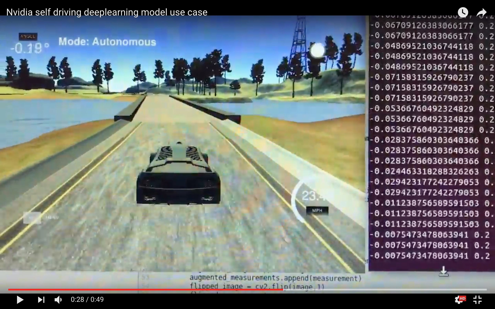

#**Behavioral Cloning** 

###Running a car in Udacity self driving car simulator using nvidia end to end self driving deep learning architecture


[](https://www.youtube.com/watch?v=UvCSL5qdOko)

---

####1. Overview

The steps used to build this model are as following:
* Use the simulator to collect data of good driving behavior
* Build, a convolution neural network in Keras that predicts steering angles from images
* Train and validate the model with a training and validation set
* Test that the model successfully drives around track one without leaving the road


[//]: # (Image References)

[image1]: ./examples/model_vis.png "Model Visualization"
[image2]: ./examples/center_2016_12_01_13_34_37_957.jpg "Right turn: 29.3 degree"
[image3]: ./examples/center_2016_12_01_13_40_10_569.jpg "Left turn: -35.5 degree"
[image4]: ./examples/center_2016_12_01_13_33_36_298.jpg "Straight- 0 degree"
[image5]: ./examples/model_vis.png "Model Visualization"
[image6]: ./examples/distribution.png "Dataset Distribution"


---

This  repository includes the following files:
* model.py containing the script to process data, create and train the model
* drive.py for driving the car in autonomous mode
* model.h5 containing a trained convolution neural network

####2.  How to run the model ?
Using the Udacity provided simulator which it has open sourced now and my drive.py file, the car can be driven autonomously around the track by executing 
```
python drive.py model.h5
```

####3. Pipeline of the project code 

The model.py file contains the code for training and saving the convolution neural network. The file shows the pipeline I used for training and validating the model, and it contains comments to explain how the code works.

###Model Architecture and Training Strategy

####1. Model Inspiration

This model is based on the architecture of [Nvidia's end to end deep learning architecture](http://images.nvidia.com/content/tegra/automotive/images/2016/solutions/pdf/end-to-end-dl-using-px.pdf) 
The model consists of 5 convolution neural network layers with 3x3 and 5x5 filter sizes and depths between 24 and 64 followed by 3 fully connected layers. It has dropouts after first convolutional layer, first fully connected layer and second fully connected layer to reduce overfitting.

The model includes RELU layers to introduce nonlinearity and the data is normalized and cropped in the model using Keras lambda and cropping2d layer. Cropping and normalizing in the model itself increased the speed as it was done on gpu which was much faster.

####2. Attempts to reduce overfitting in the model

The model contains two dropout layers between first two fully connected layers which were not a part of original Nvidia paper to avoid overfitting to this track.

The model was trained and validated on different data sets to ensure that the model was not overfitting. The model was tested by running it through the simulator and ensuring that the vehicle could stay on the track.

####3. Model parameter tuning

The model used an adam optimizer to optimize learning rate automatically.

####4. Appropriate training data

Training data was chosen to keep the vehicle driving on the road. I used a combination of center lane driving, recovering from the left and right sides of the road, using images from left and right camera with steering correction etc 

For details about how I created the training data, see the next section. 

###Model Architecture and Training Strategy

####1. Solution Design Approach

The overall strategy for deriving a model architecture was to study similar which were used for similar use cases and try to implement them as well as tweaking them as needed.

My first step was to use a simple convolution neural network layer followed by some fully connected layers to run the car and create a data pipeline. Seeing the car moving on track gave huge motivation as well as feedback to understand at what places the model might be doing wrong. Soon, this model was replaced by much more sophisticated nvidia end to end deep learning model. I thought this model might be appropriate because it was easy to implement, quite straight forward and has been used for similar purposein real lfe. 

In order to gauge how well the model was working, I split my image and steering angle data into a training and validation set. I found that my first model had a low mean squared error on the training set but a high mean squared error on the validation set. This implied that the model was overfitting. 

To combat the overfitting, I modified the model so that it has dropout layers and added more data. Then I removed around 70 pixels from the top and 25 pixels from the bottom in the image of height 320 and width 160 to discard the sky and bottom part which is not useful for the model. This also resulted in model training a lot faster. 

The final step was to run the simulator to see how well the car was driving around track one. There were a few spots where the vehicle fell off the track eg. where the right lane line disappeared for a short while or at a sharp turn. To improve the driving behavior in these cases the strategy that helped most was to give model the ability to take sharper turn if needed. This was done by removing images close to zero degree angle and having more evenly distributed dataset. 

At the end of the process, the vehicle is able to drive autonomously around the track without leaving the road.

####2. Final Model Architecture

The final model architecture consisted of a 5 convolution neural net layers with kernel size 5x5 in first three and then 3x3 in the next two and a droput after first layer. This was followed by 3 fully connected layer having dropouts after first two layers.

Here is a visualization of the architecture:

![alt text][image1]

####3. Creation of the Training Set & Training Process

To capture good driving behavior, few laps were recorded on the track one using center lane driving. The key to success was data distribution. After the data was balanced by removing images closer to 0 degree angle the model started really well. The distribution looked liked this:

![alt text][image6]

Images that were being feeded to model with steering angle looked like below for different angles:

![alt text][image3] ![alt text][image4] ![alt text][image2]

To increase the size of the dataset augmented data was also used. I also flipped images and angles thinking that this would result in model being more balanced to turn both sides as the track was just turning clockwise.

I also used images from the other two cameras to teach model recovery by using corrected steering angle for the side cameras.

I finally randomly shuffled the data set which after augmentation was 7224 samples of which 20% of the data was put aside for validation set.

I used this training data for training the model. The validation set helped determine if the model was over or under fitting. The ideal number of epochs was 10 as evidenced by no significant change in mse loss after that. I used an adam optimizer so that manually training the learning rate wasn't necessary.

Data in this project was the key to complete lap without faultering.


